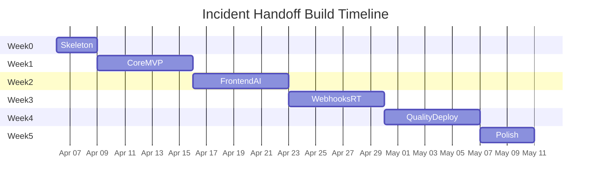

# Incident Handoff — Step-by-Step Build Plan

**Pace:** 3–4 hrs/day | **Total estimate:** ~5 weeks (35 calendar days)  
**Stack:** FastAPI, Supabase (Postgres + Storage + Auth), Redis + Celery, React + TypeScript + Tailwind, Docker, GitHub Actions

---

## Week 0 — Setup and scaffolding (Days 1–3)

### Day 1: Project skeleton

- Create a monorepo structure:

```
incident-handoff/
  backend/
    app/
      main.py
      config.py
      models/
      routes/
      services/
      workers/
    requirements.txt
    Dockerfile
    alembic/
  frontend/
    src/
      components/
      pages/
      lib/
      hooks/
    package.json
    Dockerfile
  docker-compose.yml
  .github/workflows/
  README.md
```

- Initialize Git repo, `.gitignore`, `.env.example`.
- `docker-compose.yml` with: Supabase local (or raw Postgres for dev), Redis, backend, frontend containers.
- Backend: `pip install fastapi uvicorn sqlalchemy alembic psycopg2-binary supabase python-dotenv celery redis pydantic`.
- Frontend: `npx create-vite@latest frontend --template react-ts`, install Tailwind, shadcn/ui, TanStack Query, react-router.

### Day 2: Supabase setup + data model migration

- Create Supabase project. Env: `SUPABASE_URL`, `SUPABASE_ANON_KEY`, `SUPABASE_SERVICE_ROLE_KEY`, `DATABASE_URL`.
- SQLAlchemy models: `User`, `Incident`, `IncidentRole`, `TimelineEvent`, `StatusChange`.
- Alembic: `alembic revision --autogenerate` and `alembic upgrade head`.

### Day 3: Auth with Supabase

- Supabase Auth (email/password).
- Backend: JWT verification, `get_current_user`, RBAC dependencies.
- Frontend: `@supabase/supabase-js`, Login/Signup pages, protected `/me`.

---

## Week 1 — Core incident lifecycle (Days 4–10)

### Day 4: Incident CRUD API

- `POST /incidents`, `GET /incidents`, `GET /incidents/{id}`, `PATCH /incidents/{id}`.

### Day 5: Status machine

- Transitions: `detected` → `acknowledged` → `mitigating` → `resolved` → `postmortem`.
- `POST /incidents/{id}/status` with validation and `StatusChange` logging.

### Day 6: Timeline events API

- `POST/GET/PATCH/DELETE` timeline under `/incidents/{id}/timeline`.

### Day 7: Attachments (Supabase Storage)

- Bucket `incident-attachments`; upload, signed URLs, metadata in DB.

### Day 8: Comments API

- `POST/GET /incidents/{id}/comments`.

### Day 9: RBAC + tests

- Role management endpoints; pytest for transitions and RBAC.

### Day 10: Frontend — list + create

- Incident list page, create modal, auth shell, TanStack Query.

---

## Week 2 — Frontend core + AI (Days 11–17)

### Days 11–13: Incident workspace

- Detail page: status, tabs (Timeline, Attachments, Comments, AI Summary), team sidebar, polish.

### Day 14: Celery + Redis

- Docker Compose, Celery app, smoke task.

### Day 15: AI summarizer worker

- `generate_summary(incident_id)`: gather evidence → OpenAI JSON → `AISummary` row.

### Day 16: AI summary API

- Enqueue, get versions, patch, approve, discard.

### Day 17: Frontend AI tab

- Generate, loading, edit, approve/discard, version history.

---

## Week 3 — Webhooks + real-time (Days 18–24)

### Days 18–19: Webhooks

- `POST /webhooks/{source_type}`, HMAC, idempotency, parser worker.

### Day 20: Webhook admin UI

- Delivery log table, filters, retry.

### Days 21–22: SSE

- `GET /incidents/{id}/stream`, Redis pub/sub; frontend `EventSource`.

### Days 23–24: Notifications + handoff

- `Notification` model, triggers, bell UI, transfer commander.

---

## Week 4 — Quality + deploy (Days 25–31)

### Day 25: Audit log

- `AuditLog` table, API, Activity Log tab.

### Day 26: Structured logging

- JSON logs, request ID middleware, optional Sentry.

### Day 27: Metrics

- `GET /metrics`: counts, MTTR, AI latency, webhook success rate.

### Day 28: Tests

- Pytest (status, RBAC, webhooks, AI validation); integration flows; one Playwright E2E.

### Day 29: Docker production

- Multi-stage Dockerfiles, compose profile, `/health`.

### Day 30: GitHub Actions CI

- Lint, test, build on push/PR.

### Day 31: Deploy

- Railway/Fly (API + worker), Vercel (frontend), Upstash/managed Redis.

---

## Week 5 — Polish (Days 32–35)

### Day 32: Dashboard

- Cards + charts from `/metrics`.

### Day 33: Search + postmortem

- `GET /incidents?q=...`; postmortem markdown export.

### Day 34: README

- Problem, architecture, stack, run/deploy, screenshots, tests.

### Day 35: Final sweep

- Demo video/GIF, resume bullets.

---

## Key milestones

- **Day 10:** Login, incidents, timeline, files, roles — working CRUD app.
- **Day 17:** AI summary end-to-end in UI.
- **Day 24:** Webhooks, SSE, notifications.
- **Day 31:** Deployed + CI.
- **Day 35:** Dashboard, README, demo.

---

## Gantt overview (Mermaid — render in GitHub or VS Code)



---

*Generated for PDF export. Full system design: see `prd.md` and `userflow.md` in the same folder.*
