# Incident Handoff — User Flows

## Flow Overview

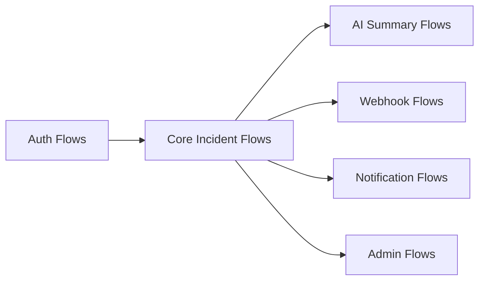
```mermaid
flowchart LR
  Auth[Auth Flows] --> Core[Core Incident Flows]
  Core --> AI[AI Summary Flows]
  Core --> Webhook[Webhook Flows]
  Core --> Notify[Notification Flows]
  Core --> Admin[Admin Flows]
```

---

## 1. Authentication Flows

### 1.1 Sign Up

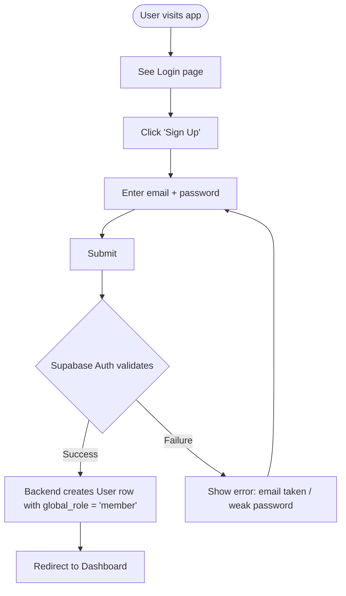
```mermaid
flowchart TD
  Start([User visits app]) --> LoginPage[See Login page]
  LoginPage --> ClickSignUp[Click 'Sign Up']
  ClickSignUp --> SignUpForm[Enter email + password]
  SignUpForm --> Submit[Submit]
  Submit --> SupaAuth{Supabase Auth validates}
  SupaAuth -->|Success| CreateProfile[Backend creates User row with global_role = 'member']
  CreateProfile --> Dashboard[Redirect to Dashboard]
  SupaAuth -->|Failure| ShowError[Show error: email taken / weak password]
  ShowError --> SignUpForm
```

### 1.2 Login

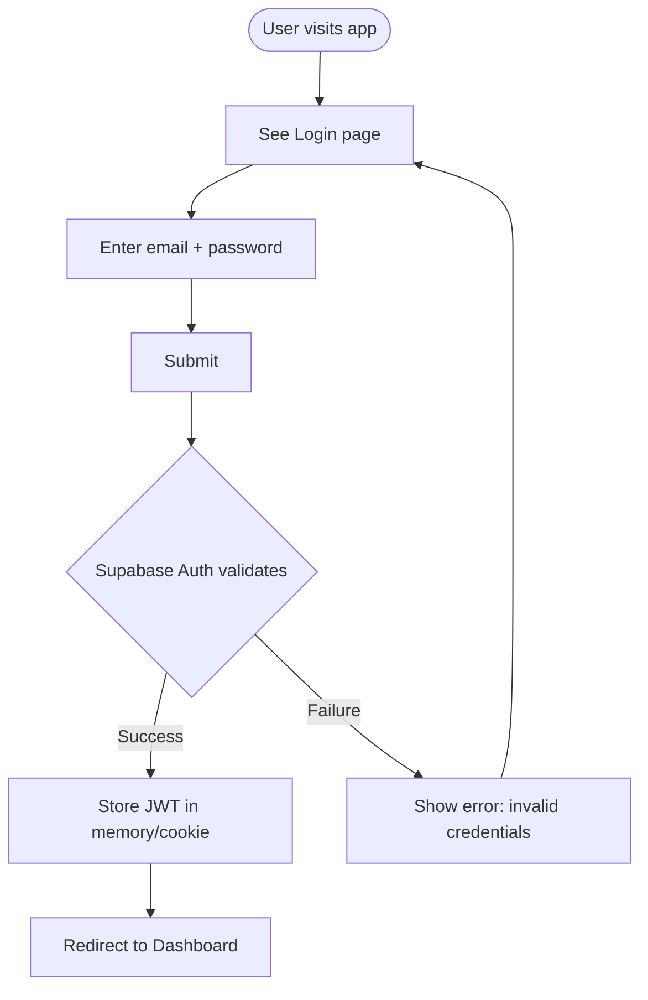
```mermaid
flowchart TD
  Start([User visits app]) --> LoginPage[See Login page]
  LoginPage --> EnterCreds[Enter email + password]
  EnterCreds --> Submit[Submit]
  Submit --> SupaAuth{Supabase Auth validates}
  SupaAuth -->|Success| StoreToken[Store JWT in memory/cookie]
  StoreToken --> Dashboard[Redirect to Dashboard]
  SupaAuth -->|Failure| ShowError[Show error: invalid credentials]
  ShowError --> LoginPage
```

### 1.3 Logout

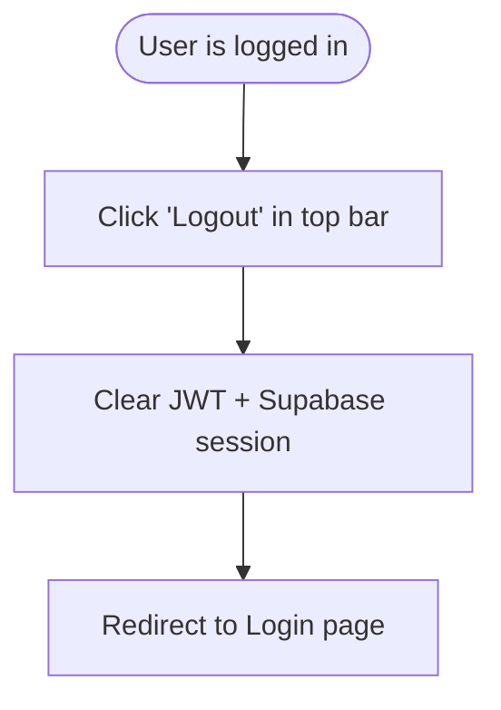
```mermaid
flowchart TD
  LoggedIn([User is logged in]) --> ClickLogout[Click 'Logout' in top bar]
  ClickLogout --> ClearSession[Clear JWT + Supabase session]
  ClearSession --> LoginPage[Redirect to Login page]
```

---

## 2. Core Incident Flows

### 2.1 Create an Incident

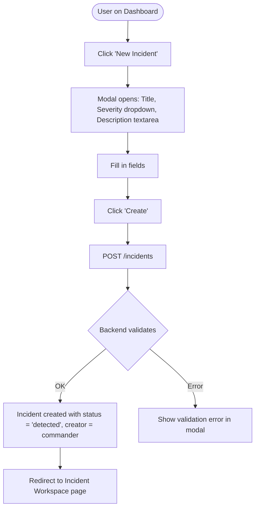
```mermaid
flowchart TD
  Dashboard([User on Dashboard]) --> ClickCreate[Click 'New Incident']
  ClickCreate --> Modal[Modal opens: Title, Severity dropdown, Description textarea]
  Modal --> Fill[Fill in fields]
  Fill --> Submit[Click 'Create']
  Submit --> API["POST /incidents"]
  API --> Backend{Backend validates}
  Backend -->|OK| Created[Incident created with status = 'detected', creator = commander]
  Created --> Redirect[Redirect to Incident Workspace page]
  Backend -->|Error| ShowError[Show validation error in modal]
```

**Who:** Any logged-in member.  
**Result:** New incident exists; creator is incident commander.

### 2.2 View Incident List

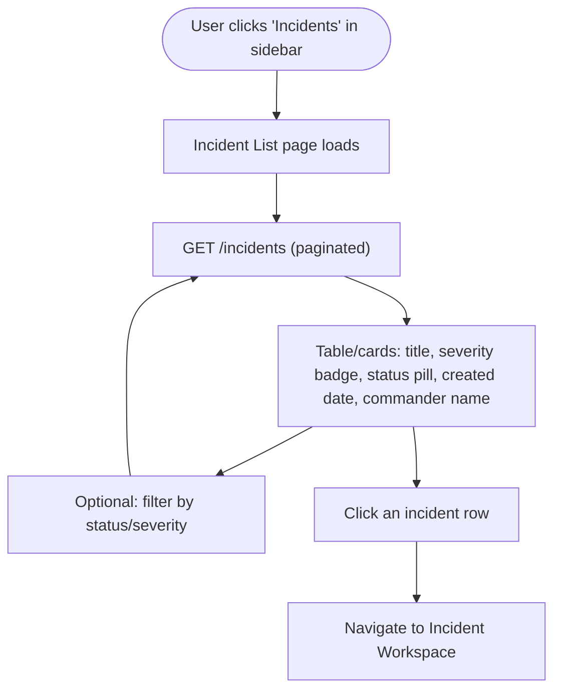
```mermaid
flowchart TD
  Nav([User clicks 'Incidents' in sidebar]) --> ListPage[Incident List page loads]
  ListPage --> Fetch["GET /incidents (paginated)"]
  Fetch --> Display[Table/cards: title, severity badge, status pill, created date, commander name]
  Display --> Filter[Optional: filter by status/severity]
  Filter --> Fetch
  Display --> ClickRow[Click an incident row]
  ClickRow --> Workspace[Navigate to Incident Workspace]
```

### 2.3 Incident Workspace (Detail Page)

```mermaid
flowchart TD
  Navigate([User opens /incidents/:id]) --> Load["Fetch incident, timeline, attachments, comments, AI summary, team"]
  Load --> Page[Render workspace page]

  Page --> Header[Header: title, severity, status, 'Change Status' button]
  Page --> Tabs[Tabs: Timeline | Attachments | Comments | AI Summary | Activity Log]
  Page --> Sidebar[Sidebar: Team members list + 'Add Member' button]
```

### 2.4 Change Incident Status

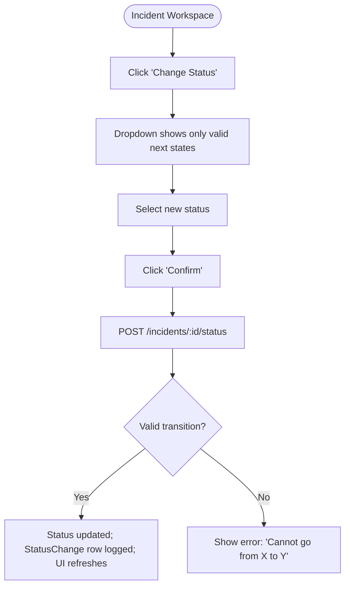
```mermaid
flowchart TD
  Workspace([Incident Workspace]) --> ClickStatus[Click 'Change Status']
  ClickStatus --> Dropdown[Dropdown shows only valid next states]
  Dropdown --> Select[Select new status]
  Select --> Confirm[Click 'Confirm']
  Confirm --> API["POST /incidents/:id/status"]
  API --> Backend{Valid transition?}
  Backend -->|Yes| Updated[Status updated; StatusChange row logged; UI refreshes]
  Backend -->|No| Error["Show error: 'Cannot go from X to Y'"]
```

**Who:** Commander only.  
**Transitions:** detected -> acknowledged -> mitigating -> resolved -> postmortem.

### 2.5 Add Timeline Event

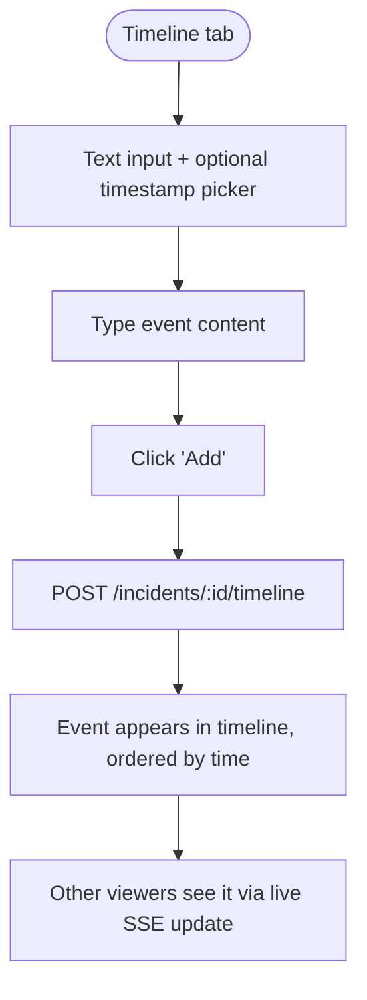
```mermaid
flowchart TD
  Timeline([Timeline tab]) --> Form[Text input + optional timestamp picker]
  Form --> Type[Type event content]
  Type --> Submit[Click 'Add']
  Submit --> API["POST /incidents/:id/timeline"]
  API --> Saved[Event appears in timeline, ordered by time]
  Saved --> SSE[Other viewers see it via live SSE update]
```

**Who:** Commander or responder.

### 2.6 Upload Attachment

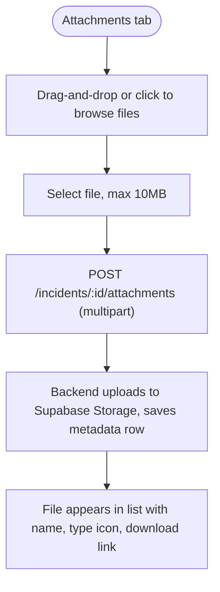
```mermaid
flowchart TD
  Attachments([Attachments tab]) --> Drop[Drag-and-drop or click to browse files]
  Drop --> SelectFile[Select file, max 10MB]
  SelectFile --> Upload["POST /incidents/:id/attachments (multipart)"]
  Upload --> Backend[Backend uploads to Supabase Storage, saves metadata row]
  Backend --> Display[File appears in list with name, type icon, download link]
```

**Who:** Commander or responder.

### 2.7 Add Comment

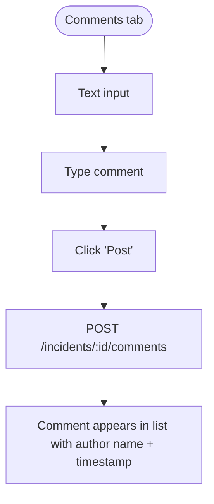
```mermaid
flowchart TD
  Comments([Comments tab]) --> Input[Text input]
  Input --> Type[Type comment]
  Type --> Submit[Click 'Post']
  Submit --> API["POST /incidents/:id/comments"]
  API --> Display[Comment appears in list with author name + timestamp]
```

**Who:** Commander, responder, or viewer.

### 2.8 Manage Team

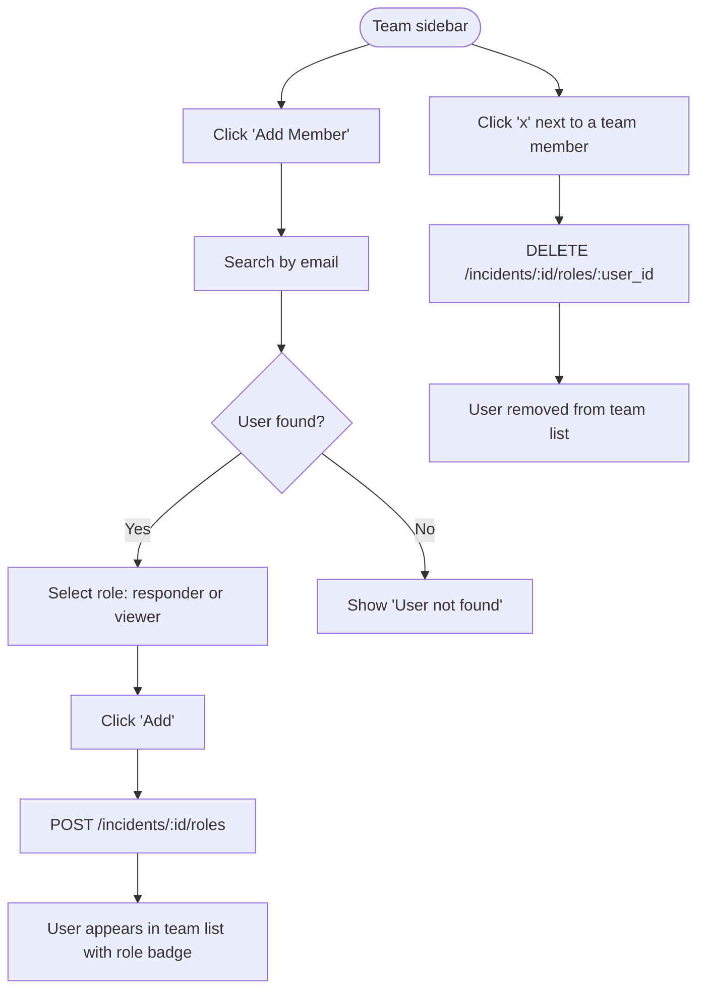
```mermaid
flowchart TD
  Sidebar([Team sidebar]) --> ClickAdd[Click 'Add Member']
  ClickAdd --> Search[Search by email]
  Search --> Found{User found?}
  Found -->|Yes| PickRole[Select role: responder or viewer]
  PickRole --> Confirm[Click 'Add']
  Confirm --> API["POST /incidents/:id/roles"]
  API --> Updated[User appears in team list with role badge]
  Found -->|No| NotFound[Show 'User not found']

  Sidebar --> ClickRemove[Click 'x' next to a team member]
  ClickRemove --> RemoveAPI["DELETE /incidents/:id/roles/:user_id"]
  RemoveAPI --> Removed[User removed from team list]
```

**Who:** Commander only.

### 2.9 Transfer Commander

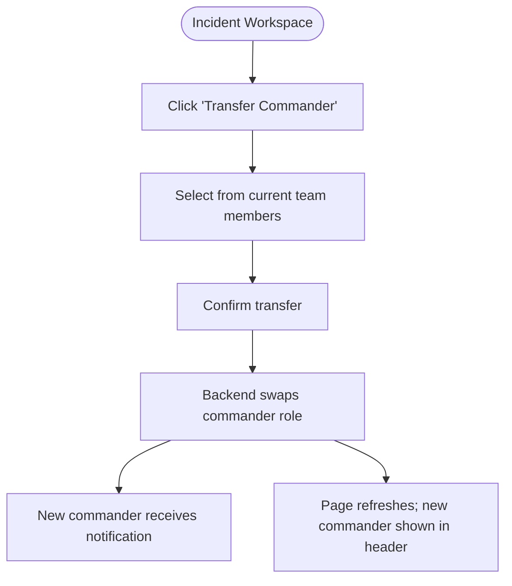
```mermaid
flowchart TD
  Workspace([Incident Workspace]) --> ClickTransfer[Click 'Transfer Commander']
  ClickTransfer --> PickUser[Select from current team members]
  PickUser --> Confirm[Confirm transfer]
  Confirm --> API[Backend swaps commander role]
  API --> Notify[New commander receives notification]
  API --> UIUpdate[Page refreshes; new commander shown in header]
```

**Who:** Current commander only.

---

## 3. AI Summary Flows

### 3.1 Generate AI Summary

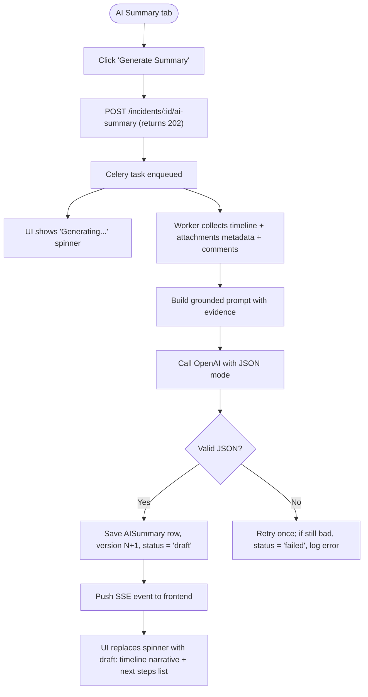
```mermaid
flowchart TD
  AITab([AI Summary tab]) --> ClickGenerate[Click 'Generate Summary']
  ClickGenerate --> API["POST /incidents/:id/ai-summary (returns 202)"]
  API --> Enqueue[Celery task enqueued]
  Enqueue --> Spinner[UI shows 'Generating...' spinner]

  Enqueue --> Worker[Worker collects timeline + attachments metadata + comments]
  Worker --> Prompt[Build grounded prompt with evidence]
  Prompt --> LLM[Call OpenAI with JSON mode]
  LLM --> Parse{Valid JSON?}
  Parse -->|Yes| Store[Save AISummary row, version N+1, status = 'draft']
  Parse -->|No| Retry[Retry once; if still bad, status = 'failed', log error]

  Store --> SSE[Push SSE event to frontend]
  SSE --> Display[UI replaces spinner with draft: timeline narrative + next steps list]
```

### 3.2 Review AI Summary

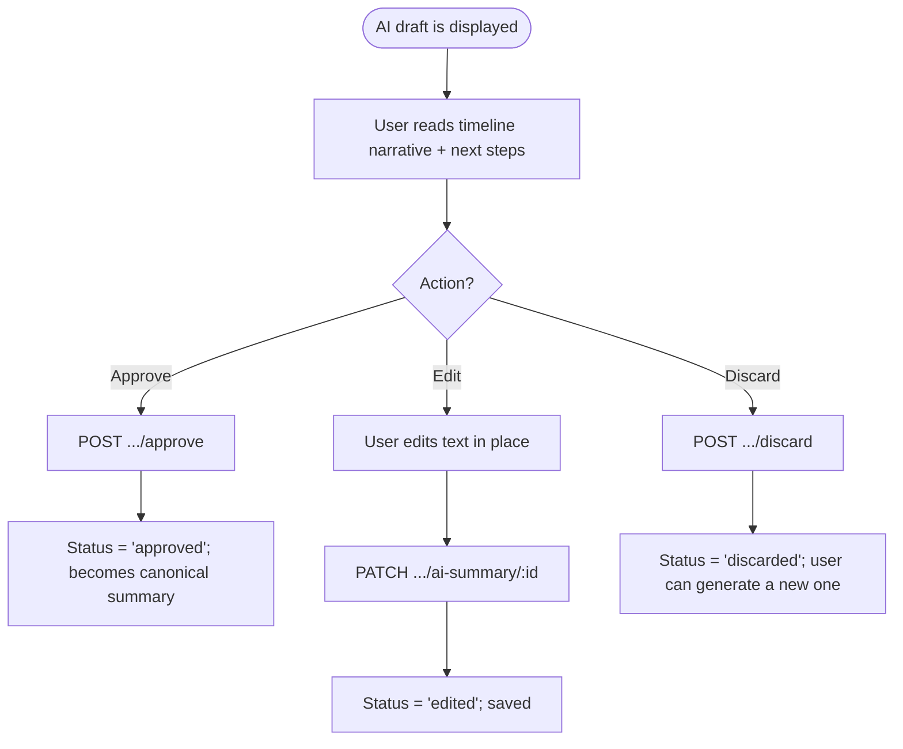
```mermaid
flowchart TD
  Draft([AI draft is displayed]) --> Read[User reads timeline narrative + next steps]
  Read --> Approve{Action?}

  Approve -->|Approve| ApproveAPI["POST .../approve"]
  ApproveAPI --> Canonical[Status = 'approved'; becomes canonical summary]

  Approve -->|Edit| EditFields[User edits text in place]
  EditFields --> Save["PATCH .../ai-summary/:id"]
  Save --> Edited[Status = 'edited'; saved]

  Approve -->|Discard| DiscardAPI["POST .../discard"]
  DiscardAPI --> Discarded[Status = 'discarded'; user can generate a new one]
```

### 3.3 View Summary History

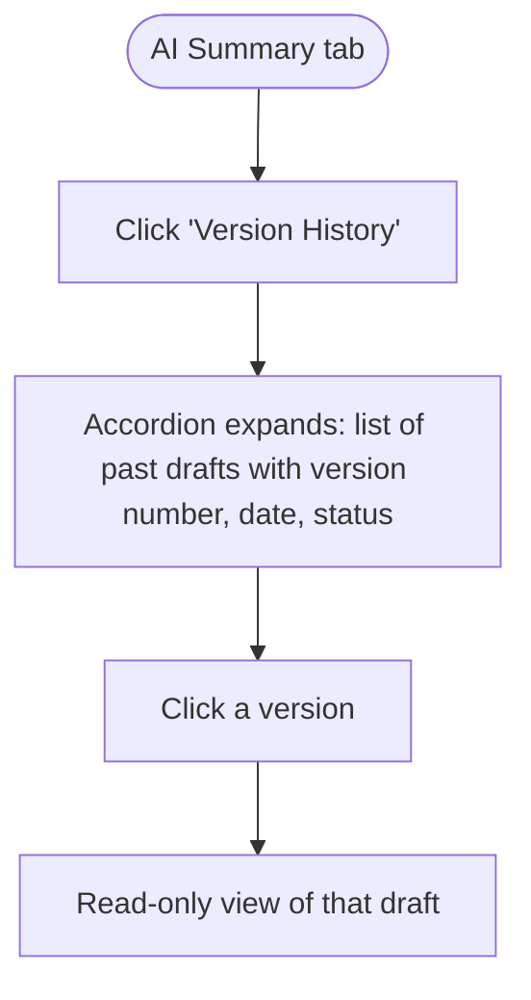
```mermaid
flowchart TD
  AITab([AI Summary tab]) --> Toggle[Click 'Version History']
  Toggle --> List[Accordion expands: list of past drafts with version number, date, status]
  List --> ClickVersion[Click a version]
  ClickVersion --> ViewOld[Read-only view of that draft]
```

---

## 4. Webhook Flows

### 4.1 External Alert Ingestion

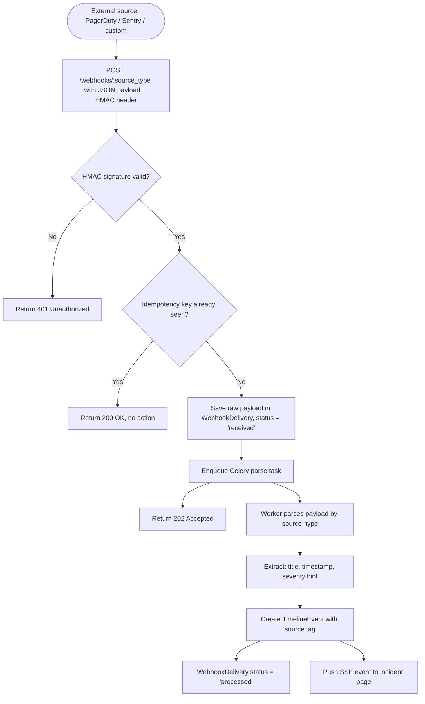
```mermaid
flowchart TD
  AlertSource([External source: PagerDuty / Sentry / custom]) --> POST["POST /webhooks/:source_type with JSON payload + HMAC header"]
  POST --> Verify{HMAC signature valid?}
  Verify -->|No| Reject[Return 401 Unauthorized]
  Verify -->|Yes| Idempotency{Idempotency key already seen?}
  Idempotency -->|Yes| Dedup[Return 200 OK, no action]
  Idempotency -->|No| Store[Save raw payload in WebhookDelivery, status = 'received']
  Store --> Enqueue[Enqueue Celery parse task]
  Enqueue --> Return[Return 202 Accepted]

  Enqueue --> Worker[Worker parses payload by source_type]
  Worker --> Extract[Extract: title, timestamp, severity hint]
  Extract --> CreateEvent[Create TimelineEvent with source tag]
  CreateEvent --> MarkProcessed[WebhookDelivery status = 'processed']
  CreateEvent --> SSE[Push SSE event to incident page]
```

### 4.2 Webhook Admin View

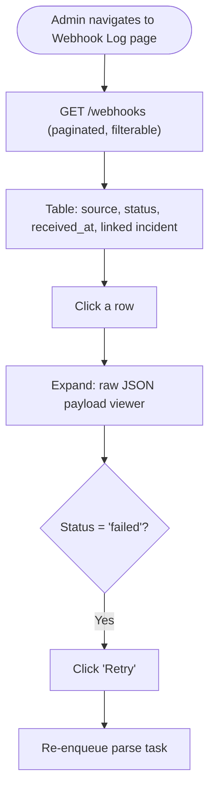
```mermaid
flowchart TD
  Admin([Admin navigates to Webhook Log page]) --> Fetch["GET /webhooks (paginated, filterable)"]
  Fetch --> Table[Table: source, status, received_at, linked incident]
  Table --> ClickRow[Click a row]
  ClickRow --> Detail[Expand: raw JSON payload viewer]
  Detail --> Retry{Status = 'failed'?}
  Retry -->|Yes| RetryBtn[Click 'Retry']
  RetryBtn --> Reenqueue[Re-enqueue parse task]
```

---

## 5. Notification Flows

### 5.1 Receive and View Notifications

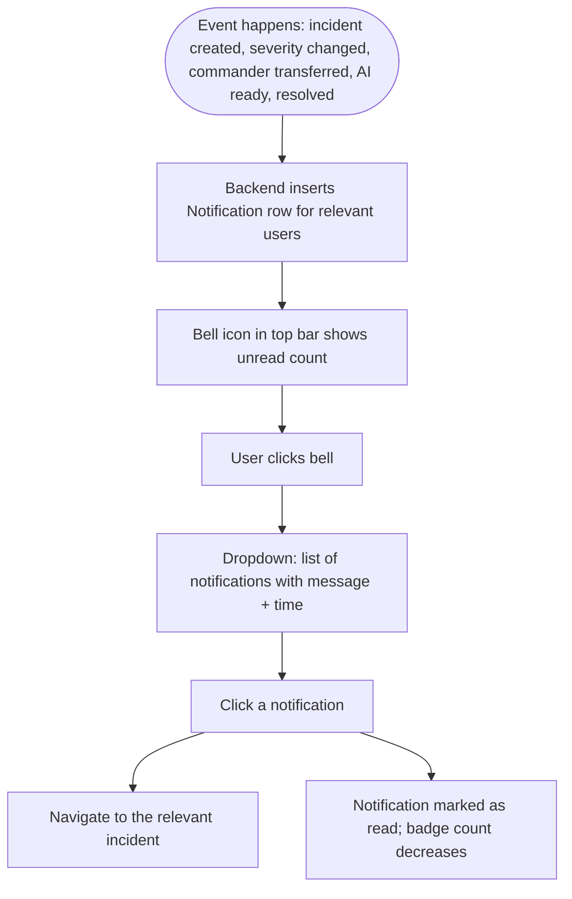
```mermaid
flowchart TD
  Trigger([Event happens: incident created, severity changed, commander transferred, AI ready, resolved])
  Trigger --> CreateNotif[Backend inserts Notification row for relevant users]
  CreateNotif --> Badge[Bell icon in top bar shows unread count]
  Badge --> Click[User clicks bell]
  Click --> Dropdown[Dropdown: list of notifications with message + time]
  Dropdown --> ClickNotif[Click a notification]
  ClickNotif --> Navigate[Navigate to the relevant incident]
  ClickNotif --> MarkRead[Notification marked as read; badge count decreases]
```

---

## 6. Admin Flows

### 6.1 View Audit Log

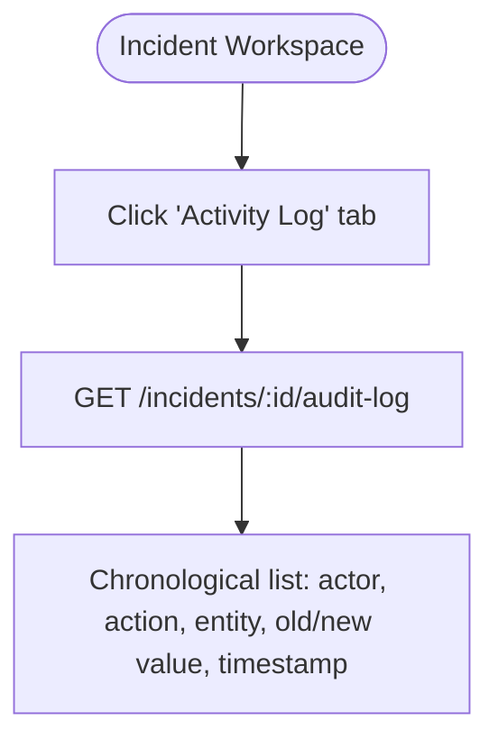
```mermaid
flowchart TD
  Workspace([Incident Workspace]) --> ActivityTab[Click 'Activity Log' tab]
  ActivityTab --> Fetch["GET /incidents/:id/audit-log"]
  Fetch --> Display[Chronological list: actor, action, entity, old/new value, timestamp]
```

**Who:** Commander or admin.

### 6.2 Dashboard

```mermaid
flowchart TD
  Nav([User clicks 'Dashboard' in sidebar]) --> Load[Dashboard page loads]
  Load --> Cards[Summary cards: open incidents by severity]
  Load --> MTTRChart[Line chart: MTTR trend over time]
  Load --> AIChart[Bar/pie: AI summary acceptance rate]
```

### 6.3 Search Incidents

```mermaid
flowchart TD
  ListPage([Incident List page]) --> SearchBar[Type in search bar]
  SearchBar --> Query["GET /incidents?q=search_term"]
  Query --> Results[Filtered incident list matching title or description]
```

### 6.4 Generate Postmortem

```mermaid
flowchart TD
  Workspace([Incident in 'postmortem' status]) --> ClickPostmortem[Click 'Generate Postmortem']
  ClickPostmortem --> API["POST /incidents/:id/postmortem"]
  API --> Compile[Backend compiles: approved summary + full timeline + severity + duration + team]
  Compile --> Markdown[Return formatted markdown document]
  Markdown --> Display[Render in page or offer download]
```

---

## 7. End-to-End Critical Path (Happy Path)

This is the primary flow that should always work and is tested with Playwright:

```mermaid
flowchart TD
  S1[1. User signs up / logs in]
  S2[2. Creates new incident: 'API latency spike', SEV2]
  S3[3. Adds 3 timeline events describing the investigation]
  S4[4. Uploads a screenshot of the error dashboard]
  S5[5. Adds a responder to the team]
  S6[6. Changes status: detected -> acknowledged -> mitigating]
  S7[7. Clicks 'Generate Summary']
  S8[8. AI returns a draft with timeline narrative + next steps]
  S9[9. User edits the draft slightly and approves it]
  S10[10. Changes status to resolved]
  S11[11. Generates postmortem document]

  S1 --> S2 --> S3 --> S4 --> S5 --> S6 --> S7 --> S8 --> S9 --> S10 --> S11
```

---

## 8. Page Map

```mermaid
flowchart TD
  Login["/login"] --> Dashboard["/dashboard"]
  Login --> Signup["/signup"]
  Dashboard --> IncidentList["/incidents"]
  IncidentList --> IncidentDetail["/incidents/:id"]
  IncidentDetail --> TimelineTab["Timeline tab"]
  IncidentDetail --> AttachmentsTab["Attachments tab"]
  IncidentDetail --> CommentsTab["Comments tab"]
  IncidentDetail --> AISummaryTab["AI Summary tab"]
  IncidentDetail --> ActivityTab["Activity Log tab"]
  Dashboard --> Notifications["/notifications"]
  Dashboard --> WebhookAdmin["/admin/webhooks"]
  Dashboard --> Profile["/profile"]
```
